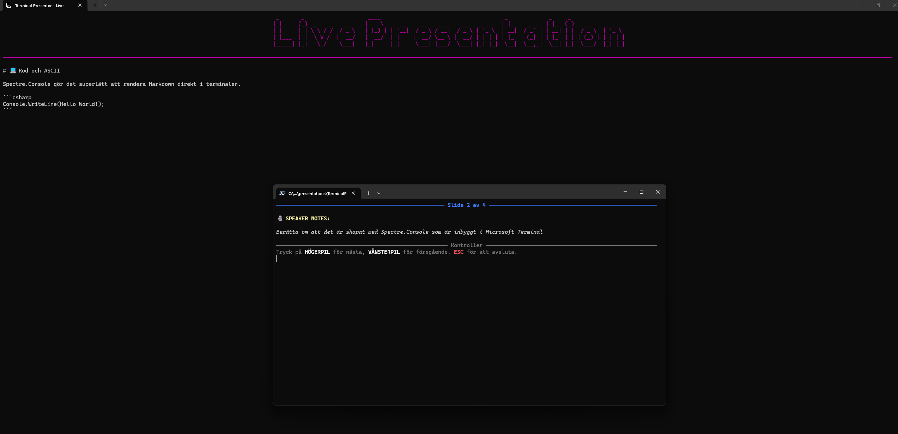

# presentations

A terminal-based program for displaying presentations from Markdown files -> the terminal.

Inspired by: https://github.com/Fjeddo/console-presenter
Which I got to see during SweNug Örebro on May 12, 2026.



> Here you can see how the program is displayed in two terminal windows. One for controlling the presentation with speaker notes, and one window for the presentation itself.


## Getting started

### Prerequisites

- [.NET 10 SDK](https://dotnet.microsoft.com/download)

### Build

```powershell
dotnet build
```

### Run presentations

```powershell
dotnet run
```
